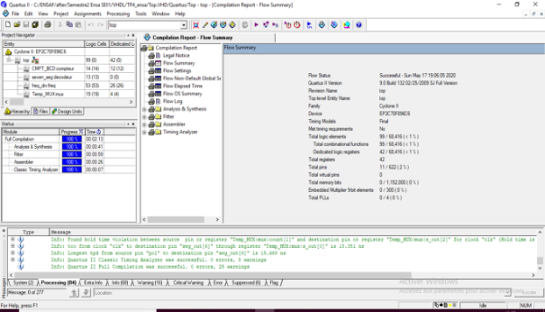
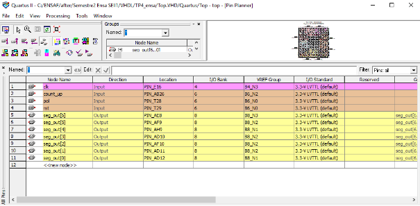
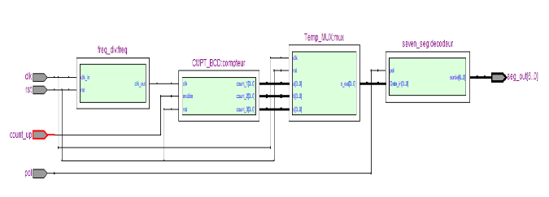
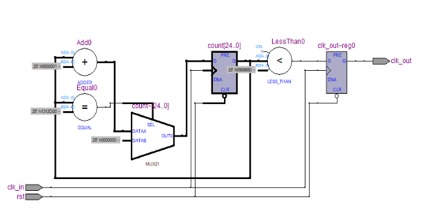
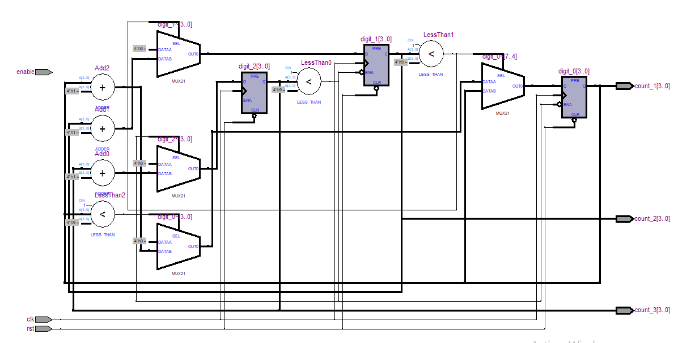
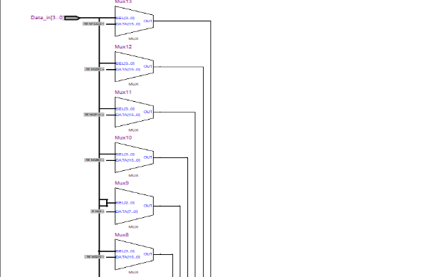
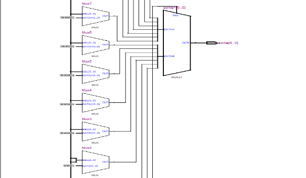
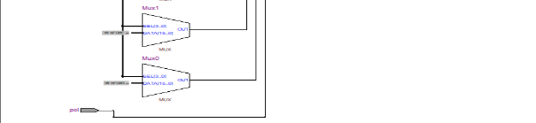

`      	`**Circuits Reprogrammables & Conception des Circuits Intégrés Numériques En VHDL**

`      				   `**Implémentation FPGA**

**1. Première compilation**

**2. Assignements des Pins**

**3. Le net List**

**4. Le schéma électronique du diviseur de Fréquence**

**5. Le schéma électronique du compteur BCD**

**6. Le schéma électronique du multiplexeur Temporel**

![]./Quartus/(Aspose.Words.18bec712-d544-4186-b812-39d7fd4f1ab3.007.png)

**7. Le schéma électronique du décodeur 7 segments**

