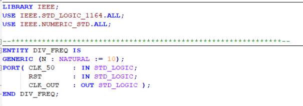
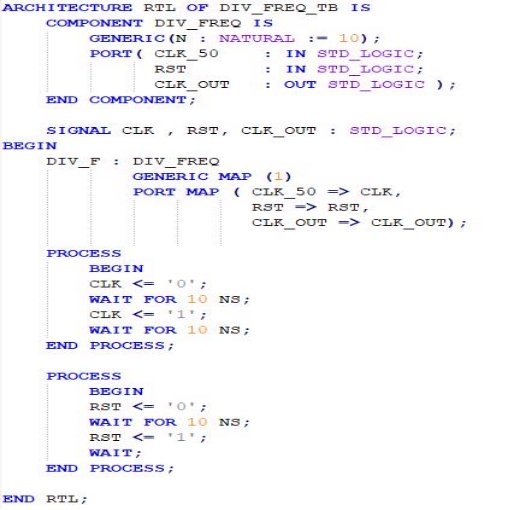

**TP : Circuits  Reprogrammables  &  Conception  des Circuits  Intégrés Numériques En  VHDL**

1ère ANNÉE GSEIII 

Objectif : L’horloge d’entrée du FPGA est une horloge de 28 MHz ou bien de 50 MHz. On désire compter de 000 à 999 au rythme d’une incrémentation toutes les « N » millisecondes, N étant paramétrable à l’instanciation par un paramètre « generic » : N. Le compteur doit repasser à 000 lorsque l’on se trouve à 999. 

A. Spécification décodeur 7-segment 

1) Programmer un décodeur 7-segment. 

2) Faire la description du module. Simuler le bloc en Modelsim. 
- Src : SEVEN\_SEG.vhd 

- Test Bench  

3) Analyse et Synthèse :  

B. Spécification du compteur BCD 

1) Le compteur BCD en VHDL 

Codez un compteur BCD qui compte toutes les N\*1 ms de 000 à 999. 

2) Faire la description du module. Simuler le bloc en Modelsim. 
- Src :  CMPT\_BCD.vhd 

- Test Bench  

3) Analyse et Synthèse : 

C. Spécification du Diviseur de Fréquence  
$$
F(clk\_out) = {F(clk) \over N }
$$
$$
 =>T(clk\_out) = T(clk) * N 
 $$

1) Faire la description du module. Simuler le bloc en Modelsim. Src : DIV\_FREQ.vhd 

- Test Bench 

3) Analyse et Synthèse : 

D. Spécification du Multiplexeur Temporel et de l’afficheur 

On alterne rapidement les trois valeurs en conjonction avec un vecteur de sélection qui active un afficheur à la fois. Grâce à la persistance retienne, on a l’impression d’un affichage simultané des trois chiffres. 

Le bloc Afficheur permet la gestion d’accès vers les afficheurs 7-segments de la carte DE2-70 board. 

1. Multiplexeur Temporel 

a)  Faire la description du module. Simuler le bloc en Modelsim. 

- Src: MUX\_TEMP\_3\_TO\_1.vhd 

- Test Bench 

2. Afficheur  

a)  Faire la description du module. Simuler le bloc en Modelsim. 

- Src : AFFICHEUR.vhd 

- Test Bench 

E. TOP  
1) Faire la description du module. Simuler le bloc en Modelsim. 
- Src : TOP\_MUX\_AF.vhd 

- Test Bench 

2) Analyse et Synthèse :  

5. Top final 
- Src : TOP.vhd 

- Test Bench 

- Analyse et Synthèse : 

**1. Première compilation**

**2. Assignements des Pins**

